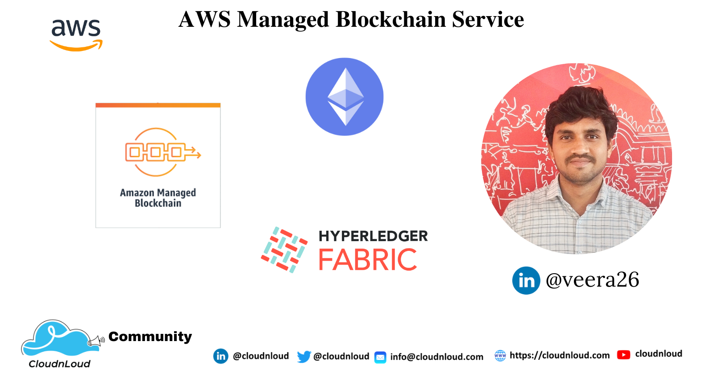
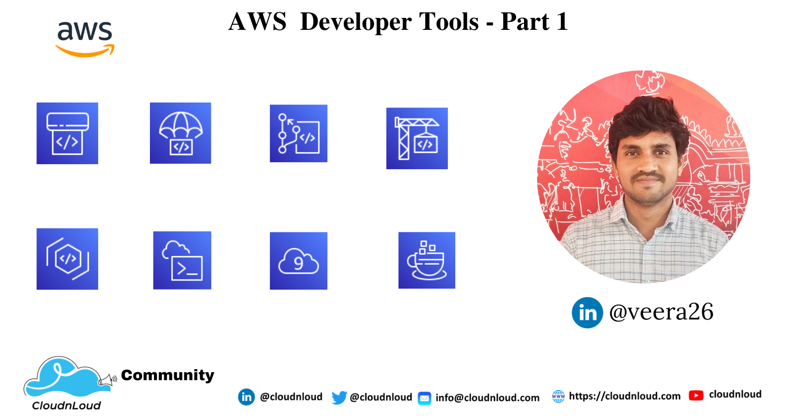
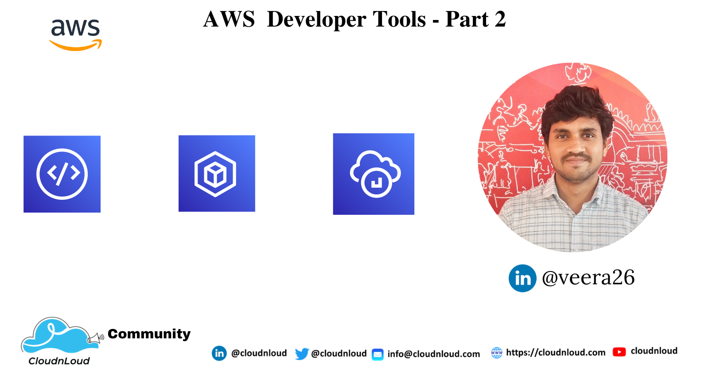

<h1 align="center">Hi 👋, I'm Veerasolaiyappan</h1>
<h3 align="center">Fullstack developer</h3>

 

- 👯 I’m looking to collaborate on **Fullstack, Blockchain, Cloud && Devops**

- 🤝 I’m looking to help in **Web and Mobile application development**

- 📫 How to reach me **newlinedeveloper@gmail.com**

 

### TECHNICAL CONTRIBUTION && VOLUNTEERING

#### ROLE: Core Team Member ( Developer Advocate)

I am being part of 𝐂𝐥𝐨𝐮𝐝𝐧𝐋𝐨𝐮𝐝 𝐓𝐞𝐜𝐡 𝐂𝐨𝐦𝐦𝐮𝐧𝐢𝐭𝐲 Core team.

The CloudnLoud Tech Community is a non-profit open source tech community, volunteer-run events presenting by members of the CloudnLoud Community.

The goal of our community is to bring together companies, leaders and professionals from around the world to share ideas, socialize and work together on advancing the present and future success of the project. We are part of this for good cause to save millions of Cancer children.

At CloudnLoud Tech community, we are organizing free tech conferences, technical trainings and technical discussions on various IT technologies & open source tools.

## AWS Cloud Free 2 months Internship - Week 1

- [Cloud DevOps Free 4 months UseCase RealTime Internship](https://youtu.be/V-2ME9qCGIk)
- [Syllabus - Cloud DevOps Free 4 months UseCases Real-time Internship](https://youtu.be/8PsJG53-D6U)
- [AWS Cloud DevOps UseCase Internship Day1 Slot1](https://youtu.be/POfrtFFNq3Y)
- [AWS Cloud DevOps UseCase Internship Day1 Slot2](https://youtu.be/0IXpnDOR81M)
- [AWS Cloud DevOps UseCase Internship Day1 Slot3](https://youtu.be/aHobd28K9eo)
- [AWS Cloud DevOps UseCase Internship Day1 Slot4](https://youtu.be/O_kWJgQbh8U)
- [AWS Cloud DevOps UseCase Internship Day2 Slot1](https://youtu.be/IWC9Pw-AKfw)
- [AWS Cloud DevOps UseCase Internship Day2 Slot2](https://youtu.be/bxZ_7l1tuA4)
- [AWS Cloud DevOps UseCase Internship Day2 Slot3](https://youtu.be/wcACvI70SYk)

## AWS Cloud Free 2 months Internship - Week 2

- [AWS Cloud DevOps UseCase Internship Day3 Slot1](https://youtu.be/S6jyaTq6PWo)
- [AWS Cloud DevOps UseCase Internship Day3 Slot2](https://youtu.be/w9CrsuZ0cP8)
- [AWS Cloud DevOps UseCase Internship Day4 Slot1](https://youtu.be/cnRzm_MlM5g)
- [AWS Cloud DevOps UseCase Internship Day4 Slot2](https://youtu.be/VOpHbf-JPdw)
- [AWS Cloud DevOps UseCase Internship Day4 Slot3](https://youtu.be/TfCfTI_LH9o)

## AWS Cloud Free 2 months Internship - Week 3

- [AWS Cloud DevOps Use Case InternShip Day5 Slot1](https://youtu.be/pvIgAj3XSag)
- [AWS Cloud DevOps Use Case InternShip Day5 Slot2](https://youtu.be/zXxFQZ-xwdA)
- [AWS Cloud DevOps UseCase Internship Day5 Slot3](https://youtu.be/WBn_xOmT4xc)
- [AWS Cloud DevOps Internship Week 3 Day 6 Slot1](https://youtu.be/RNl-gXDrCoU)
- [AWS Cloud DevOps Internship Week 3 Day 6 Slot2](https://youtu.be/8Q9ftmHx1aA)

## AWS Cloud Free 2 months Internship - Week 4

- [AWS Cloud DevOps UseCases Internship Week 4 Day 7 Slot1](https://youtu.be/0S_rqkVfNTc)
- [AWS Cloud DevOps UseCases Internship Week 4/Day 7-Slot2](https://youtu.be/EBi89LuXhLc)
- [AWS 𝐂𝐥𝐨𝐮𝐝 𝐃𝐞𝐯𝐎𝐩𝐬 𝐔𝐬𝐞𝐂𝐚𝐬𝐞𝐬 𝐈𝐧𝐭𝐞𝐫𝐧𝐬𝐡𝐢𝐩 𝐖𝐞𝐞𝐤 𝟒 𝐃𝐚𝐲 8 Slot1](https://youtu.be/n4IlrolvkCA)
- [AWS 𝐂𝐥𝐨𝐮𝐝 𝐃𝐞𝐯𝐎𝐩𝐬 𝐔𝐬𝐞𝐂𝐚𝐬𝐞𝐬 𝐈𝐧𝐭𝐞𝐫𝐧𝐬𝐡𝐢𝐩 𝐖𝐞𝐞𝐤 𝟒 𝐃𝐚𝐲 8 Slot2](https://youtu.be/VbGey_cjBPI)
- [AWS 𝐂𝐥𝐨𝐮𝐝 𝐃𝐞𝐯𝐎𝐩𝐬 𝐔𝐬𝐞𝐂𝐚𝐬𝐞𝐬 𝐈𝐧𝐭𝐞𝐫𝐧𝐬𝐡𝐢𝐩 𝐖𝐞𝐞𝐤 𝟒 𝐃𝐚𝐲 8 Slot3](https://youtu.be/ExzBULc8Oqg)

## AWS Cloud Free 2 months Internship - Week 5

- [AWS Cloud DevOps UseCase Internship Week 5 Day 9 Slot2](https://youtu.be/LR83GLZhsH4)
- [AWS Cloud DevOps UseCase Internship Week 5 - Day 9 - Slot1](https://youtu.be/p2ntu-VHnBI)
- [AWS Cloud DevOps UseCase Internship Week 5 Day 10 Slot1](https://youtu.be/t0KTVWfBlpg)
- [AWS Cloud DevOps UseCase Internship Week 5 Day 10 Slot2](https://youtu.be/xL57lnOWK7Y)
- [AWS Cloud DevOps UseCase Internship Week 5 Day 10 Slot3](https://youtu.be/6GlXJn41d3A)

## AWS Cloud Free 2 months Internship - Week 6

- [AWS Cloud Devops Usecase Internship Week 6 Day 11 Slot1](https://youtu.be/fBJEz4LxAdg)
- [AWS Cloud Devops Usecase Internship Week 6 Day 11 Slot2](https://youtu.be/tLwZUKuS7Z0)
- [AWS Cloud Devops UseCase Internship Week 6 Day 12 Slot 1](https://youtu.be/n5aFlLMpTYg)
- [Cloud Devops UseCase Internship Week 6 Day 12 Slot 2](https://youtu.be/fXWsBhGA8rw)

## AWS Cloud Free 2 months Internship - Week 7

- [Cloud DevOps Usecase Internship Week 7 Day 13 Slot1](https://youtu.be/vo4X-IKkwwU)
- [Cloud DevOps Usecase Internship Week 7 Day 13 Slot2](https://youtu.be/L2ZUF6e2bJ4)
- [AWS Cloud DevOps UseCase Internship Week 7 Day 14 Slot 1](https://youtu.be/Tcg-Vx9NPyo)
- [AWS Cloud DevOps UseCase Internship Week 7 Day 14 Slot2](https://youtu.be/D0N1TGC7g6g)

## AWS Cloud Free 2 months Internship - Week 8

- [AWS Cloud DevOps UseCase Internship Week 8 - Day 15 - Slot 1](https://youtu.be/dy1W4VQuDEI)
- [AWS Cloud DevOps UseCase Internship Week 8 - Day 15 - Slot 2](https://youtu.be/sZtKLSAIw28)
- [AWS Cloud DevOps UseCase Internship Week 8 Day 16 Slot 1](https://youtu.be/ZHuvfk6VOZs)
- [AWS Cloud DevOps UseCase Internship Week 8 Day 16 Slot 2](https://youtu.be/KlVfpKrFChM)

## AWS weekly-cloud-engineer-interview-program - GitHUB

- [AWS weekly-cloud-engineer-interview-program](https://github.com/cloudnloud/weekly-cloud-engineer-interview-program)

## Cloudnloud Community 2022 Free Programs

- [Cloudnloud Community 2022 Free Programs](https://www.linkedin.com/pulse/cloudnloud-community-2022-recap-vijayabalan-balakrishnan/?trackingId=PmMIBLn1QIq41XTgN3Q%2BYw%3D%3D)

Follow / reach us with the below links:

<!-- For **any queries** use our CloudnLoud Discord **https://discord.gg/vbjRQGVhuF**      -->
	
Check **Posts and events sections** in our CloudnLoud LinkedIn page for **upcoming free technical sessions/events**: **https://www.linkedin.com/company/cloudnloud**
	
Check for **Cloud & DevOps full series** in our CloudnLoud Youtube Channel  **https://www.youtube.com/c/cloudnloud**
	
For all use cases refer our CloudnLoud Github **https://github.com/cloudnloud**
     
CloudnLoud Facebook **https://www.facebook.com/cloudnloudtech**
	
CloudnLoud Twitter **https://twitter.com/cloudnloud**			  
			     

### Blogs posts
<!-- BLOG-POST-LIST:START -->

- [AWS MANAGED BLOCKCHAIN SERVICE](https://blog.cloudnloud.com/why-your-business-should-consider-aws-managed-blockchain)

- [AWS Developer Tools - Part 1](https://blog.cloudnloud.com/aws-developer-tools-part-1)

- [AWS Developer Tools - Part 2](https://blog.cloudnloud.com/aws-developer-tools-part-2)

- [INFRASTRUCTURE DIAGRAM AS CODE](https://blog.cloudnloud.com/infrastructure-digrams-as-code)

- [INFRASTRUCTURE AS CODE - TERRAFORM](https://blog.cloudnloud.com/infrastructure-as-code-terraform)

- [MONGODB OVERVIEW](https://blog.cloudnloud.com/mongodb-overview)
- [MYSQL OVERVIEW](https://blog.cloudnloud.com/mysql-overview)
- [NODE JS OVERVIEW](https://blog.cloudnloud.com/node-js-overview)
- [REACT JS OVERVIEW](https://blog.cloudnloud.com/react-js-overview)
- [MONOLITTHIC VS MICROSERVICE](https://blog.cloudnloud.com/monolithic-vs-microservice)
- [MICROSERVICE ARCHITECTURE - USECASES](https://blog.cloudnloud.com/microservice-architecture-usecases)
- [AZURE DEVOPS OVERVIEW](https://blog.cloudnloud.com/azure-devops-overview)

<!-- BLOG-POST-LIST:END -->

<h3 align="left">Connect with me:</h3>

<h3 align="left">Languages and Tools:</h3>

                                                                

  

  

  

&nbsp;

